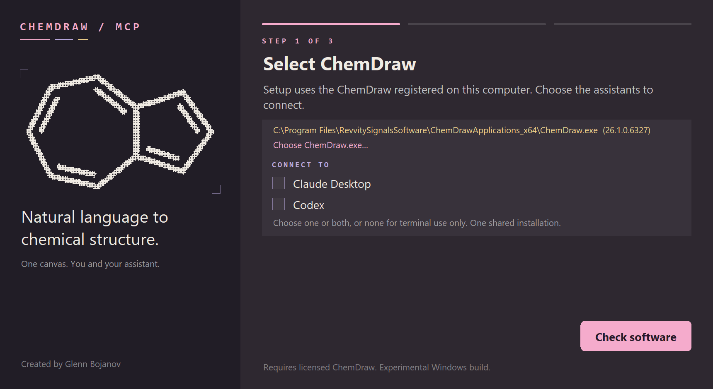

# ChemDraw MCP for Windows

Native, editable chemical drawings from your assistant or terminal, now on Windows.
Read your unsaved ChemDraw edits, build aligned molecule tables in the same
document, and export figures at a consistent chemical scale.

**[Download for Windows (x64)](https://github.com/marcodecorti11/chemdraw-mcp-win/releases/tag/v0.10.0rc22-win.6)** ·
[Test results and known gaps](docs/WINDOWS_PORT_RESULTS.md) ·
[Examples and customization](docs/GETTING_STARTED.md) ·
[Architecture](docs/ARCHITECTURE.md)

> **Looking for macOS?** This repository is the Windows port. The original macOS
> project, with the Mac installer, is
> [glebo309/chemdraw-mcp-macos](https://github.com/glebo309/chemdraw-mcp-macos)
> by Glenn Bojanov.



## Install on Windows

You need 64-bit Windows and your own licensed ChemDraw. Testing used Windows 11 and
ChemDraw Professional 26.1; Windows 10 and other ChemDraw versions are untested.

1. Open the [release page](https://github.com/marcodecorti11/chemdraw-mcp-win/releases/tag/v0.10.0rc22-win.6)
   and download `ChemDraw-MCP-Windows-x64-0.10.0rc22-win.6.zip`. Optionally compare it with
   `SHA256SUMS` (PowerShell: `Get-FileHash -Algorithm SHA256 <zip>`).
2. Extract the zip on a local disk (not a network share) and run **ChemDraw MCP Setup.exe**
   inside the `ChemDraw MCP` folder.
3. Choose the assistants to connect: Claude Desktop, Claude Code (terminal), Codex (app and CLI),
   Gemini CLI, any combination, or none.
4. Start ChemDraw yourself and open any drawing (File > New is fine), then press
   **Test connection**, then **Finish**. Restart the connected apps, or start a new session in a
   terminal assistant.

The files are not code-signed, so Windows SmartScreen may warn the first time.
Python and all dependencies are included; nothing else needs to be installed.

Setup changes only your own user account: it copies the program to
`%LOCALAPPDATA%\ChemDraw MCP`, adds its `bin` folder to your user PATH once, and adds one
`glecko_chemdraw` entry per selected assistant, keeping your other settings and a backup of
each edited configuration. The MCP server never starts or closes ChemDraw itself.

After setup, a new terminal also has the command line: `chemdraw-mac doctor` checks the
installation, `chemdraw-mac --help` lists the commands.

**Terminal assistants.** Claude Code is connected through its own `claude mcp add` command (user
scope); if `claude` is not on PATH, setup shows the exact command to run later. Codex CLI shares the
Codex settings, and Gemini CLI gets an entry in `~/.gemini/settings.json`. Any other MCP-capable tool
can use the same local (stdio) server:
`"%LOCALAPPDATA%\ChemDraw MCP\current\chemdraw-runtime.exe" --desktop-serve`. Only one assistant
can drive ChemDraw at a time.

**Updating:** run the newer release's setup. Assistant settings are kept, the previous version
stays installed beside the new one, and no duplicate entry is added.

**Problems:** setup saves a diagnostics file automatically under
`%LOCALAPPDATA%\ChemDraw MCP\Logs`. Please attach it when you report an issue.

## Status of the Windows port

Tested on one Windows 11 laptop with ChemDraw 26.1:
unit suite 1424 passed, 0 failed; native tests against ChemDraw 78 passed and 2 failed (both
explained); a clean install, an update, the setup flow and a scripted assistant session passed.
Not yet tested on a second machine or with a real Claude Desktop or Codex restart.

Not available on Windows, because ChemDraw's Windows automation does not offer them:
PDF export and the align/distribute commands. Other remaining gaps are listed in
[Windows test results and known gaps](docs/WINDOWS_PORT_RESULTS.md).

Build the installer from source on 64-bit Windows with
`python scripts/build_windows.py <new folder> --version <version> --uv <path to uv.exe>`.

## Credit and license

This is a fork of Glenn Bojanov's [ChemDraw MCP for macOS](https://github.com/glebo309/chemdraw-mcp-macos),
ported to Windows ChemDraw (COM automation). The chemistry, layout and drawing engine are his;
the Windows bridge and installer were added here. Licensed like the original under
[GNU AGPL version 3 only](LICENSE); see [NOTICE](NOTICE) and
[third-party notices](THIRD_PARTY_NOTICES.md). ChemDraw is proprietary software of its vendor;
this project is not affiliated with or endorsed by it.

---

*The sections below come from the original project and describe the shared drawing engine.
Mac-only details in them (`install.sh`, `.app` paths, AppleScript, macOS permissions) do not
apply on Windows.*

## Ask for the result

> Draw caffeine in my current ChemDraw document.

Reviewed bundled names (currently caffeine/caffein) resolve locally, without
depending on PubChem availability. Other supplied names/CAS through
`chemdraw_draw` include PubChem lookup without another confirmation.
Say "offline" or "no network" to disable provider lookup;
the assistant must then pass `allow_network=false`. Only the supplied query is
sent, not the drawing. Explicit SMILES/InChI inputs remain local.

> Read my edited parent structure. Make an eight-member scope, align the common
> scaffold, center the structures and captions, and add pages in this document
> if needed. Do not invent yields.

> Export this document as PDF and transparent 600-DPI PNGs, preserving molecular scale.

The drawing harness checks explicit graphs, native output, layout and source
preservation. Shared tables use measured ink centres and common caption
baselines; complete batches can add physical pages without shrinking molecules.
One hidden native copy measures the table before final insertion. Physical-scale
SVG/PNG exports keep bond size consistent instead of fitting every molecule to
the same image width. Native PDF retains paper pages. No HTML review is required
for ordinary shared drawings or physical-scale exports.

[Worked examples](docs/GETTING_STARTED.md) ·
[Drawing request format](docs/DRAWING_HARNESS.md) ·
[Export settings and limits](docs/PHYSICAL_EXPORT.md)

Version rc18 adds native circled unit charges to ordinary explicit reactions,
with saved ownership and bond/label clearance checks. Version rc17 batches
complete explicit reactions, measures their native ink,
and selects A4 or A3 paper without shrinking molecules or removing participants.
Reaction exports include physical-scale SVG, 600-DPI transparent PNG and a white
preview. [Reaction workflow and limits](docs/REACTION_BATCH.md).

Version rc16 introduced lighter native previews, optional canvas-only delivery,
per-stage timings and validated name-lookup reuse. Fresh regular six-membered
rings are axis-aligned; a live scaffold reference still takes precedence.
[Delivery choices](docs/DRAWING_HARNESS.md#drawing-speed-and-export-choices) ·
[Measured performance](docs/DRAWING_PERFORMANCE.md)

Control desktop ChemDraw from a terminal or an MCP-connected assistant. Create native structures and explicit reaction rows, import local styles, design mapped aromatic scopes, inspect identifiers, resolve names with explicit network opt-in, polish figures, add supported electron/charge symbols and curves, or batch-export finished drawings. Inspect native exports and keep editable output plus a chemical audit.

**Native ChemDraw rendering.** The desktop JavaScript API reads and appends supported molecule batches; bounded AppleScript handles other native commands and exports. RDKit supplies validated graphs and coordinates through its ChemDraw CDXML writer, not images. ChemDraw renders SVG; offline `resvg` rasterizes its unchanged artwork for transparent PNG. Ordinary explicit reactions use whole-document batching; advanced legacy workflows retain native import/cleanup. Natural-language interpretation comes from your MCP client, not an embedded LLM.

Independent, open-source experimental project under [AGPLv3](LICENSE). Native workflows require your own licensed ChemDraw installation; identifier inspection, style extraction and scope proposals are offline. MCP named drawings include PubChem lookup of the supplied query by default, with an explicit offline override. Standalone resolution and CLI lookup retain their opt-in flags. Only ChemDraw 23.0.1 has been live-tested here; individual feature evidence remains separate. [Compatibility and limits](docs/COMPATIBILITY.md)

**Experimental, not a stable release:** native support is limited to the tested ChemDraw build and supported drawing subset. Cross-process coordination and opt-in circled charges have regression coverage; crowded charge positions fail explicitly rather than risking a changed molecular graph. See [current development status](docs/DEVELOPMENT_STATUS.md) for exact checks and pending acceptance on another Mac.

## Two layers, one native MCP

**The core MCP already works on its own.** Use it to import, create, inspect,
clean, style and export native ChemDraw documents. The optional workflow layer
adds reusable drawing, layout and validation operations. Your connected AI client
interprets natural language and chooses the tools; there is no LLM inside this server.

| Mode | Launch command | Intended use |
| --- | --- | --- |
| Core | `chemdraw-mcp-macos --profile core` | Direct native document tools; no RDKit required |
| Drawing | `chemdraw-mcp-macos --profile drawing` | Focused drawing, diagnostics and physical-export tools |
| Full (default) | `chemdraw-mcp-macos --profile full` | Core plus drawing, reaction, scope and validation workflows |

Both modes use the same native bridge. Full workflows accept structures and recipes,
not a fixed catalogue of molecules. Experimental metal-complex work is an additional
capability, not something users must wait for before using the core MCP.
See [architecture, installation and design principles](docs/ARCHITECTURE.md) and
[client configuration](docs/MCP_CLIENTS.md#choose-core-or-full).

## Existing document or background export

`chemdraw_draw` and `chemdraw_draw_structures` reuse a visible working document in `auto` mode for supported
molecules and captions. Untitled documents do not need saving first. Specify
`presentation="shared", document_id=ID` when several documents are open. Native
API insertion uses planned coordinates and preservation checks in the same
document, without clipboard or keyboard movement. [Shared delivery requirements and limits](docs/USAGE.md).

Use `live-read` and `live-action` to inspect and run supported native commands on
the document already open in ChemDraw, without another working window or preview.
Fresh snapshots detect changed content before dispatch. `visibility` shows/hides
one document. `render --input drawing.cdxml --output /absolute/new-folder`
exports supplied CDXML in a hidden window and closes that owned document after
success. Both MCP profiles expose matching tools.

This is on-request synchronization, not continuous collaborative editing.
Arbitrary atom edits still use the separate copy workflow. Background rendering
requires a logged-in licensed Mac desktop; it is not a display-free server mode.
[Commands, evidence and limits](docs/LIVE_DOCUMENT.md)

## Acknowledgments

Special thanks to **Marco DeCorti** for showing what makes a chemical drawing clear and visually polished, providing reference examples, and carefully checking the generated output. His input helped shape the project's molecular drawing style and visual quality standards.

## Native before and after

Both drawings below are exports from desktop ChemDraw, not a substitute renderer. GitHub previews have a solid white background for readability in light and dark themes; original exports remain transparent. Reproduce them with the included example and recipe below.

| Before | After |
|---|---|
|  |  |

## Complete jobs and reusable lab settings

The v0.9 workflow layer connects the individual tools into callable jobs:

- **Complete scope:** `scope-job` proposes from an explicit mapped parent, requires candidate acceptance, draws and aligns the selected compounds, and lays out actual category bands with headings, dotted dividers and a shadow frame. [Recipe](examples/scope-job.json) · [Guide](docs/SCOPE_JOB.md)
- **Explicit reaction series:** `reaction-series` composes up to three supplied reaction rows, including supported water/halides, ionic salts and coefficients. It does not predict products or certify balance. [Guide and limits](docs/REACTION_EXPANDED.md)
- **Owned movement and routes:** `build-ownership` / `move-owned` carry explicit captions, symbols and internal curves with their molecules. `suggest-routes` / `apply-route` propose and render a selected obstacle-checked cubic path. Reaction-scheme vertical moves and one-sided cross-owner curve moves are refused; manual dragging is not covered. [Guide](docs/OWNERSHIP.md)
- **Shared styles:** `make-lab-style` / `styled-job` use versioned, hashed numerical settings and reject conflicting recipe overrides. Each output retains its exact style package. [Starting package](examples/publication-bold.lab-style.json) · [Guide](docs/LAB_STYLE.md)

Native workflows have MCP counterparts and retain editable CDXML and an audit, with images according to the requested delivery mode. Start with the [reproducible demo walkthrough](docs/DEMO_WALKTHROUGH.md). Experimental packages are available on GitHub Releases; independent-Mac acceptance remains open in the [release checklist](docs/RELEASE_CHECKLIST.md).

## First drawing in one command

After [terminal setup](docs/TERMINAL_INSTALL.md), open a blank ChemDraw document:

```sh
chemdraw-mac first-run
```

This draws caffeine and aspirin in the active document and validates native
exports. It is an optional drawing test, not the package installer. Interactive
onboarding cycles through native molecular silhouettes with pink/lavender/gold
accents. The bar tracks workflow phases and completes only after native checks
pass. It does not claim an installation-time estimate. Nothing installs or
licenses ChemDraw for you.

Already in a checkout? Use `uv run --locked --extra chemistry chemdraw-mac first-run` instead for the committed dependency lock. Outputs go to a new uniquely named folder, the final drawing stays editable in ChemDraw, and pre-existing documents are preserved. Use `--json` for scripts or `--no-open --no-animation` for a quiet terminal. [First-run behavior and troubleshooting](docs/FIRST_RUN.md)

**Desktop apps work too:** connect the same local MCP server to Claude Desktop or your Codex desktop client, then ask it to run `chemdraw_first_run`. No terminal animation or automatic browser launch is sent over MCP. [Desktop client setup](docs/MCP_CLIENTS.md)

## Try the polishing workflow

From the project directory, with `uv` installed and ChemDraw running and activated:

```sh
uv sync --locked --extra chemistry
uv run --extra chemistry chemdraw-mac doctor
uv run --extra chemistry chemdraw-mac polish \
  --input examples/messy-oxidation.cdxml \
  --recipe examples/oxidation-recipe.json \
  --output /absolute/existing/parent/oxidation-review
```

Replace the output path with a **new absolute directory** whose parent exists. The output directory must not already exist. The example depicts illustrative ethanol-to-ethanal oxidation with `[O]`, not an experimental protocol.

Open the returned `review.html`. The output contains:

- `before.cdxml`, `before.svg`, `before.png`
- `figure.cdxml`, `figure.svg`, `figure.png`
- `recipe.json`, `audit.json`, `review.html`

The source is not edited; the final working document remains open in ChemDraw. `checks_passed` means the implemented preservation and layout checks passed. It does **not** mean that the source chemistry is correct or that a human has approved the figure. Visual review remains required.

## Make an analogue

The included example changes the existing chlorine atom to bromine and updates the caption, without rebuilding or rotating the scaffold:

| Original | Analogue copy |
|---|---|
|  |  |

```sh
uv run --extra chemistry chemdraw-mac edit \
  --input examples/chlorobenzoic-acid.cdxml \
  --recipe examples/bromo-analogue-recipe.json \
  --output /absolute/existing/parent/bromo-analogue-review
```

The editor changes a copied CDXML graph, opens it in desktop ChemDraw and checks the native saved result. It is **not** a direct native atom-setter API. RDKit validates chemistry; it does not render the figure. The audit reports requested atom/bond changes, observed hydrogen changes and native atom-coordinate preservation. This bounded editor supports one molecule and explicitly assigned captions, not arbitrary reaction transformations. [Edit recipes and supported operations](docs/USAGE.md#analogue-editing)

CDXML chemical labels are checked separately from the graph. Neither check proves that every exported SVG/PNG glyph is correct. A resolved input-label orientation issue is documented in [known issues](docs/KNOWN_ISSUES.md); inspect the actual preview before using it.

## Arrange a scope grid

Keep the existing molecular orientations, normalize bond scale, and arrange explicitly assigned compounds in a chosen order. Names and compound/yield labels use shared baselines within each row. Native measured ink bounds determine cell size and page fit, including captions.

| Before | Four-column grid |
|---|---|
|  |  |

```sh
uv run --extra chemistry chemdraw-mac grid \
  --input examples/scope-input.cdxml \
  --recipe examples/scope-recipe.json \
  --output /absolute/existing/parent/scope-review
```

**All percentages in this example are invented software-test values, not experimental yields.** A zero is displayed as `0%`; an absent yield is not invented. The recipe explicitly owns every molecular fragment and existing caption. Multiple fragments, such as a salt, can belong to one compound and translate together after normalization. Omit `columns` for automatic column selection, or specify it; a grid that does not fit is rejected instead of shrinking molecules. [Grid recipes, tokens and limits](docs/USAGE.md#scope-grids)

## Batch-export finished figures

Export an explicit manifest of supported CDXML files without changing their styling or layout:

```sh
uv run --extra chemistry chemdraw-mac batch \
  --manifest /absolute/path/figures.json \
  --output /absolute/existing/parent/manuscript-figures
```

Each stable figure key gets native CDXML/SVG, a PNG rasterized from native SVG, optional PDF/CDX, an audit and retained snapshots. The batch `review.html` is a contact sheet with links and per-item status. Sources are opened as private copies; successful working copies are closed. Source hashes, the exact open-document inventory and pre-existing unsaved document content are checked. A native-operation error stops the batch without retrying the operation or closing an uncertain document. Unsupported inputs are reported individually; a mixed-failure run exits nonzero. [Manifest, output layout and limits](docs/USAGE.md#batch-export)

Batch also accepts the supported annotation subset: existing full-headed or left/right-fishhook cubic curves and explicitly associated circled-charge symbols. It reuses the annotation preservation verifier alongside the ordinary molecule/reaction checks. Unknown curve/symbol types still fail closed. Exporting a mechanism does not route its arrows, repair collisions or certify its chemistry.

## Add electron-flow arrows

In the full MCP profile, assistants have `chemdraw_inspect_annotations` and
`chemdraw_annotate_document`, plus symbol and route tools. The smaller core and
drawing profiles do not expose these annotation workflows. A reaction-series
diagram alone is not a complete electron-pushing mechanism. Check the client's
actual tool list before reporting that arrows are unavailable. Annotation creates
a new copy and requires explicit chemical intent, not automatic mechanism inference.

The SN2 reference now has a reproducible annotation workflow. Add native editable full-headed two-electron curves or left/right fishhooks for one-electron flow, using explicit atom/bond endpoints or a displayed donor-symbol source:

```sh
uv run --extra chemistry chemdraw-mac annotate \
  --input examples/sn2-annotation-input.cdxml \
  --recipe examples/sn2-annotation-recipe.json \
  --output /absolute/existing/parent/sn2-review
```

The workflow adds curves to copied CDXML and desktop ChemDraw saves/renders the result. Existing supported molecules, their orientation and symbols are retained. A recipe supplies endpoints and both cubic controls; this is not automatic routing or mechanism inference. Explicit symbol sources identify an existing negative charge/lone pair for a full arrow or electron dot for a fishhook. Tails start at the visible edge calibrated from native ChemDraw 23.0.1 exports, selecting an actual dot rather than the gap between a lone pair. These source-arrow cases passed native integration checks on the development Mac. Whole-route collisions still require visual review, and no chemical edits or native moving-attachment guarantees apply. [Annotation recipes and limits](docs/USAGE.md#electron-flow-annotations)

Use the separate `inspect-symbols` / `symbols` workflow to add native lone-pair symbols, graphical electron dots or circled symbols for existing +1/-1 atom charges in a new copy. Electron dots deliberately use native filled-circle graphics: ChemDraw's Electron Symbol would otherwise change an adjacent atom's radical state. Requests identify each owning atom; bounded placement uses calibrated glyph geometry and measured labels. Four native integration cases passed for negative-charge creation and charge/lone-pair/electron source-arrow workflows. This is not full rendered-bond-ink collision coverage or a cross-version guarantee; inspect each native export. [Symbol recipes](docs/USAGE.md#electron-and-charge-symbols), [electron-flow conventions](docs/MECHANISM_CONVENTIONS.md)

## Optional scope framing

Add a rounded shadowed box, true dotted group dividers and optional headings to an existing grid with `decorate-scope` or MCP `chemdraw_decorate_scope`. Groups are explicit: the tool preserves your molecules, captions and positions instead of silently classifying or reordering them. Frame and dividers can be enabled independently. [Recipe and native-object contract](docs/SCOPE_DECORATION.md)

[Native framed-scope example](assets/standard-scope-framed.svg) · [Editable input](examples/scope-decoration-input.cdxml) · [Reproducible recipe](examples/scope-decoration-recipe.json)

## From explicit structures to a native figure

For supported ions, add `"charge_style": "circled"` to the draw manifest to create native circled charge symbols in the same job. [Try the ionic example](examples/ions-circled.json). The default remains `"plain"`. The refined search supports the house-style nitrobenzene example without shrinking symbols or weakening owner checks. Crowded arrangements such as the current tetramethylammonium drawing still have no safe candidate and are rejected; plain-charge drawing remains available. Returned `artifacts` points to the actual final CDXML/SVG/PNG, including the optional charge pass.

`draw` accepts a manifest of explicit `{compound_id, label, smiles}` records. It preserves the supplied chemical identity through MOL seeding, native import and native Clean Up Structure, then hands the measured native structures to the grid workflow:

```sh
uv run --extra chemistry chemdraw-mac draw \
  --manifest /absolute/path/structures.json \
  --output /absolute/existing/parent/structures-review
```

Labels are caller-supplied, not verified chemical names. The first interface accepts 1 through 24 connected, supported nonradical structures of 2 through 150 atoms each. It produces editable CDXML, SVG, PNG, retained seeds and an audit. Optional manifest `scaffold_smiles` selects an explicit common core to align to the first structure using rotation and translation only, with no reflection or alignment scaling. Without it, native cleanup can choose a different orientation for each molecule. No name lookup, yield generation or automatic core inference is performed. [Manifest and preservation limits](docs/USAGE.md#draw-native-structures-from-smiles)

The included [acetophenone scope manifest](examples/acetophenone-scope-draw.json) contains fourteen explicit candidates with short relative labels, an explicit acetophenone scaffold and no yields. Use it as `--manifest` for the three-column example. It is an illustrative proposal, not experimental scope data. The alignment-enabled fourteen-structure run passed native checks and visual inspection on the development Mac: [native SVG figure](assets/standard-scope.svg). See [project progress](PROJECT_PROGRESS.md) for run evidence and environment limits.

## Propose a starter substrate scope

Supply the actual parent and mark the benzene carbon attached to its existing reaction handle. For example:

```sh
uv run --extra chemistry chemdraw-mac propose-scope \
  --parent 'O=C[c:1]1ccccc1' --handle-map 1
```

The bounded standard profile proposes fourteen distinct candidates: parent reference; ortho/meta/para methyl; para methoxy, trifluoromethyl, cyano, nitro and F/Cl/Br; ortho isopropyl/tert-butyl; and 2,6-dimethyl. Duplicate candidates across electronic and steric categories are merged. Every yield stays null. The output includes relative labels, mapped/unmapped SMILES, stable graph-derived IDs and reasons to consider each candidate.

This is an offline proposal for an isolated monosubstituted benzene ring, not reaction prediction or a universal scope recommendation. Review/select candidates before passing explicit records to `draw`. The parent, reaction handle, chemical compatibility and experimental outcomes are not guessed. [Scope proposal contract](docs/USAGE.md#propose-an-aromatic-substrate-scope)

For pre-substituted rings and isolated five/six-membered heteroaromatics, explicitly map the H-bearing carbon sites and select a custom list from ten curated groups:

```sh
uv run --extra chemistry chemdraw-mac scan-scope --manifest examples/scope-custom.json
```

The example scans two mapped pyridine sites with Me and Cl, giving five distinct candidates including the parent. Each product receives one addition; symmetry duplicates retain their requested site variants. The limit is 100 requested combinations including the optional parent before deduplication. [Expanded scope contract](docs/SCOPE_EXPANDED.md)

## Build a reaction or use a local style

```sh
uv run --extra chemistry chemdraw-mac reaction \
  --manifest examples/reaction-build.json \
  --output /absolute/existing/parent/reaction-review

uv run chemdraw-mac import-style --input /absolute/path/my-style.cds
```

The reaction example explicitly supplies ethanol, ethanal and the label `oxidation`; it supplies no experimental conditions or yields. The builder accepts one through three compounds on each side, draws the native arrow, plus signs and owned labels, then checks measured spacing and page fit. It does not predict or balance reactions. [Reaction contract](docs/REACTION_BUILDER.md)

Style inspection extracts supported typography/bond settings from local `.cds`, `.cdx` or `.cdxml`, reports defaults and unapplied properties, and leaves the source untouched. Add `--style /absolute/path/my-style.cds` to `draw` or `reaction` to override the manifest preset. Required label/caption font families are checked on the rendering Mac. Template artwork, page geometry, colour palettes and font files are not imported or redistributed. [Style contract](docs/STYLE_IMPORT.md)

## Inspect identifiers offline

```sh
uv run --extra chemistry chemdraw-mac identify --value 'CCO' --format smiles
```

Returns canonical isomeric SMILES, formula, charge, component/isotope/stereo summaries and Standard InChI/InChIKey when available. InChI normalization warnings and graph-roundtrip differences are explicit. No name/CAS service or native application is contacted. [Strict input and output semantics](docs/IDENTIFIERS.md)

The separate resolver supports explicit name or CAS input:

```sh
uv run --extra chemistry chemdraw-mac resolve --query caffeine --kind name --allow-network
```

`--allow-network` authorizes sending this query to PubChem. The response retains provenance, ambiguity, truncation and chemistry-validation results for up to 20 candidates. No candidate is selected automatically, even for one hit. CAS syntax/checksum checks do not certify CAS Registry ownership. Review an explicit candidate before drawing. [Resolver contract](docs/RESOLVER.md)

A photo or hand sketch can be interpreted by an image-capable connected assistant, which must resolve ambiguous atoms, bonds and stereo before submitting an explicit graph. There is no image recognizer or OCR service in this server, and identifier validation does not prove that a graph matches its source image.

## Connect an assistant

For app-specific Claude Desktop JSON and Codex TOML setup, see [desktop client instructions](docs/MCP_CLIENTS.md). This is a local stdio server, not a remote web connector.

The basic bridge does not require RDKit. Install with `uv sync --locked` for native import, cleanup, styling and export only. For identifiers, resolution, scope proposals and validated native figure workflows, retain the optional chemistry extra as above. `identify`, `propose-scope`, `scan-scope`, `import-style` and `resolve` do not require a running ChemDraw application; only `resolve` requires explicit network opt-in. Launch the installed executable directly from your MCP client:

```json
{
  "mcpServers": {
    "chemdraw_native": {
      "command": "/absolute/path/chemdraw-mcp-macos/.venv/bin/chemdraw-mcp-macos"
    }
  }
}
```

Merge this entry into the client's existing configuration; do not replace unrelated entries. `chemdraw-mac serve` starts the same stdio server. A silent terminal waiting for a client is normal. API drawing starts a private authenticated loopback listener on demand; the opt-in resolver makes outbound HTTPS requests.

Example requests:

> Inspect my open ChemDraw documents and report their current document IDs.

> Analyze this document, identify its molecule captions and arrow conditions, then make a house-style row-layout copy in a new output folder. Show me the native before/after review and audit.

> Export this revised working document as SVG and transparent PNG. Keep my original open.

> Analyze this single molecule, identify its chlorine atom, then make a bromine analogue in a new document. Preserve the scaffold and replace the caption. Show the chemical diff and native before/after exports.

> Arrange these products into four columns, keeping their orientation. Use the compound IDs and yields I supply, retain their names underneath, and show the native page-fit audit and preview.

> Export these finished CDXML files under my supplied figure keys, add PDF copies, and give me a contact sheet. Do not restyle the drawings or touch my open originals.

> Inspect this mechanism's atom/bond IDs, then add these specified electron-flow curves in a new copy. Preserve the structures and circled charges, and show the native before/after review.

> For this explicit mapped parent, propose the standard aromatic scope and explain each category. Leave yields blank. After I select the compounds, create a native drawing with the labels I supply.

> Inspect this SMILES without contacting a database. Report any unspecified stereo or InChI normalization difference.

Set `CHEMDRAW_APP` to the absolute `.app` path when discovery is ambiguous. `CHEMDRAW_MCP_WORKSPACE` changes the default `~/ChemDraw-MCP-Output` scratch/backup location. Allow the launching application to control ChemDraw if macOS requests Automation permission. No unattended installer or automatic permission changer exists yet.

## Available tools

The following tools are available in the full profile; the complete-job tools are
described above. The smaller core profile exposes only the direct native tools
listed in [architecture](docs/ARCHITECTURE.md#what-core-provides). Identifiers,
style extraction and scope proposals are offline; only explicit resolver calls use PubChem:

| Tool | Behaviour |
|---|---|
| `chemdraw_doctor` | Reports installation, live connection and optional validator availability |
| `chemdraw_first_run` | Checks setup, draws a fixed native example and returns editable files and JSON checks without HTML |
| `chemdraw_draw_complex` | Experimental [explicit coordination drawing](docs/METAL_COMPLEXES.md): supplied XYZ, front/back chelate bonds, black default labels and corner charge annotation; checked after native saving, no geometry prediction. Ferrocene remains a refused regression fixture. |
| `chemdraw_list_documents` | Native document IDs, names, paths, modified flags and molecule counts |
| `chemdraw_inspect_document` | Native molecule indices/bounds and document settings |
| `chemdraw_inspect_targets`, `chemdraw_prepare_selection`, `chemdraw_edit_targets` | Snapshot-bound atom/H/charge and bond-order edits, supplied-fragment attachment, branch removal, wedges, rings and native subset alignment; bounded placement search and native clearance checks in new copies. [Recipes and limits](docs/TARGETED_EDITING.md) |
| `chemdraw_native_action` | Direct ChemDraw cleanup, alignment, distribution and label commands on owned working copies; [selection and availability limits](docs/USAGE.md#direct-native-actions) |
| `chemdraw_draw_name` | ChemDraw's own Name to Structure, with explicit network consent and native review exports; no RDKit seed or renderer |
| `chemdraw_analyze_document` | Exports a snapshot and reports supported object geometry plus a top-level source token; editable single molecules also receive atom/bond IDs |
| `chemdraw_polish_document` | Makes a normalized copy, optional explicit row layout, native review exports, recipe and audit |
| `chemdraw_edit_document` | Makes an analogue copy from explicit atom/H and bond-order edits; checks the expected source token, mapped product chemistry, coordinates and CDXML labels |
| `chemdraw_grid_document` | Makes a scope-grid copy with explicit compound/caption ownership, optional yields, native measured spacing and saved-page fit checks |
| `chemdraw_decorate_scope` | Adds an optional editable rounded shadow frame, dotted separators and explicit group headings while preserving the existing scope |
| `chemdraw_batch_export` | Sequentially exports explicit CDXML files under stable keys, with per-item audits, retained snapshots and a contact sheet; stops on uncertain native operations |
| `chemdraw_inspect_annotations` | Snapshots supported annotation drawings and reports atom/bond IDs, native atom-label bounds, existing curve geometry and a source token |
| `chemdraw_annotate_document` | Adds explicit full or fishhook cubic curves to a new copy; checks native curve geometry, supported existing charge-symbol associations and source preservation |
| `chemdraw_identify` | Strict offline SMILES/Standard InChI inspection with graph summaries, conversion availability and normalization warnings |
| `chemdraw_resolve` | Explicitly opted-in PubChem name/CAS candidate lookup with provenance and validation; no automatic selection |
| `chemdraw_import_style` | Read-only local style extraction with validated preset, source hash, defaults and unapplied-property report |
| `chemdraw_scan_scope` | Explicit mapped-site scans on supported pre-substituted and heteroaromatic parents using curated groups |
| `chemdraw_build_reaction` | Creates a native one-step row from explicit reactants/products and supplied conditions, with measured ownership/layout checks |
| `chemdraw_inspect_symbols` | Snapshots supported atom/symbol inventory, geometry and current source token |
| `chemdraw_add_symbols` | Adds explicitly requested graphical dots or existing formal-charge symbols to a new copy with bounded placement |
| `chemdraw_propose_scope` | Offline, map-anchored standard aromatic candidate proposal with relative labels, rationales and null yields; no drawing or reaction prediction |
| `chemdraw_draw_structures` | Creates native drawings from explicit SMILES/label records using MOL seeds, native import/cleanup, optional explicit-scaffold rigid alignment and a measured grid; no name lookup or automatic core inference |
| `chemdraw_import_file` | Opens a private copy of local CDXML, CDX, MOL or SDF |
| `chemdraw_create_document` | Opens caller-supplied CDXML in a new working file |
| `chemdraw_clean` | Native cleanup of one molecule or the document, with recovery backup; edits the target |
| `chemdraw_apply_style` | Creates a `house` or `acs-1996` styled copy; does not rescale coordinates |
| `chemdraw_export` | Native CDXML, CDX, SVG and PDF; PNG from native SVG |
| `chemdraw_close_working_document` | Backs up and closes only documents opened by this server session |
| `chemdraw_list_styles` | Returns numerical preset settings |

Both CLI and MCP call the same workflow implementation. [Usage and recipe reference](docs/USAGE.md)

## Scope and safety

- Polish supports a conservative flat, single-page molecular drawing subset. Groups, nested abbreviations, queries, polymers and enhanced stereo are rejected rather than guessed through.
- Positive uniform scaling normalizes each molecule's median bond length. Existing orientation is preserved. This does not make molecules equally wide or repair every bond angle.
- Row layout requires explicit caption and condition ownership. Ordinary unassigned text is rejected; label ownership is not guessed.
- Polish does **not** run native Clean Up Structure automatically. Cleanup is separate because it can change orientation and depiction.
- Analogue editing does not insert/delete atoms, change stereocentres, create/remove potential stereo or change charged/isotopic target atoms. It does not infer new names or fix collisions.
- Scope grids require one physical page of supported fragments and explicitly owned captions. Reactions, arbitrary text, nested groups and native symbol graphics are unsupported. Plain formal-charge atom attributes are supported; general charge-symbol placement is not.
- Batch export accepts supported flat CDXML and the bounded annotation subset, with no styling or layout changes. Full/half-headed cubic curves and explicitly associated circled charges are verified. Unknown graphics remain unsupported; any reaction scheme inferred by ChemDraw is not chemically certified.
- Annotations support a separate bounded subset with existing circled-charge graphics and single-cubic electron-flow curves. Explicit references belong to the recipe; they do not promise native moving attachment. The separate symbols workflow adds supported graphical dots/charges without chemical or radical-state edits. No automatic mechanism inference runs.
- The offline scope proposers attach only curated groups to supported mapped parents. This does not enable arbitrary atom insertion/deletion in an existing ChemDraw document or certify reaction compatibility.
- `draw` creates new structures from explicit graphs, uses native cleanup and retains the first native import's page settings. Positive scale normalization and nonoverlapping uniform staging cells precede native composition, followed by measured grid-fit verification; the tool does not create custom paper sizes. Its optional circled-charge finishing pass uses the separate symbol verifier. The underlying grid still rejects general molecular graphics.
- Chemistry is checked after native export. Glyph collisions, charge placement, source correctness and unsupported chemistry still need review.
- Existing output paths are rejected. Draw creates new private structures; imports, polish, analogue editing, grids, annotations and batch export use working copies. Explicit low-level cleanup edits its target after a backup.
- Backups remain local and contain chemical data. Only explicit `resolve` calls with network permission send queries to PubChem; other workflows stay local. Connected AI clients have separate privacy policies.
- Updated CLI/MCP clients share a per-user process lock, including native working-copy workflows. A competing call waits at most two seconds before returning busy without dispatching its native operation. Manual GUI edits, older clients and other automation software do not honor this lock. [Coordination contract](docs/NATIVE_COORDINATION.md)
- An AppleEvent timeout has an uncertain outcome and is not retried automatically. Inspect ChemDraw before retrying.
- No raw AppleScript, arbitrary menu, clipboard or quit tool is exposed. Native commands are allowlisted; unrestricted molecular editing is not implemented.

## Development and provenance

```sh
uv sync --locked --extra chemistry
uv run --extra chemistry pytest
CHEMDRAW_LIVE_TEST=1 uv run --extra chemistry pytest tests/test_live.py tests/test_scope_live.py tests/test_batch_live.py tests/test_annotations_live.py tests/test_draw_live.py -vs
```

Native tests are opt-in and require an available licensed application. [Contributing and verification](CONTRIBUTING.md)

The geometry layer adapts `Box`, `find_overlaps` and `grid_positions` from Michael Leitch's MIT-licensed [live-chemdraw-mcp](https://github.com/MALeitch/live-chemdraw-mcp), not its Windows COM bridge. See [third-party notices](THIRD_PARTY_NOTICES.md), [pinned upstream sources](upstream-sources.json), [research](docs/UPSTREAM_RESEARCH.md) and [roadmap](docs/ROADMAP.md).

Offline identifiers are documented in [the identifier contract](docs/IDENTIFIERS.md); the separate opt-in PubChem interface is documented in [resolver semantics](docs/RESOLVER.md). [Native Name to Structure](docs/USAGE.md#native-name-to-structure) uses ChemDraw's lookup rather than the PubChem resolver. [Layout and workflow research](docs/LAYOUT_WORKFLOW_RESEARCH.md) records the scope-grid motivation and further improvements. Use this README and the usage reference for interfaces, and [project progress](PROJECT_PROGRESS.md) for actual validation evidence.

## License and collaboration

Original project code is available under [GNU AGPL version 3 only](LICENSE), with [copyright and warranty notices](NOTICE). Commercial and noncommercial use are allowed. Covered redistribution and modified network-served versions carry source-sharing obligations; the licence text governs. This does not automatically license users' drawings or research, nor every independent client that connects over MCP.

Contributions are welcome: test another Mac/ChemDraw version, report a reproducible drawing problem, share a redistributable example, or send a focused pull request. Start with [CONTRIBUTING.md](CONTRIBUTING.md). Do not upload confidential structures or proprietary assets. Marco DeCorti's visual guidance and upstream authors' contributions remain credited.

Retained upstream licences remain applicable to their respective code. ChemDraw is proprietary software and a trademark of its respective owner; this project is not affiliated with or endorsed by its vendor. Open-source availability does not establish a stable release or compatibility beyond the documented tests.
